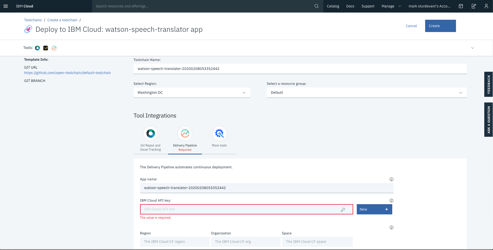
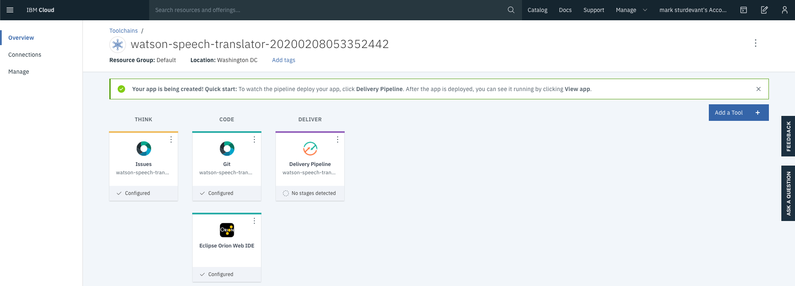

# Run on IBM Cloud with Cloud Foundry

This document shows how to deploy the server using Cloud Foundry on IBM Cloud.

1. Click the above `Deploy to IBM Cloud` button and then click on the `Delivery Pipeline` tool integration.

   

2. Create an API key by pressing the `Create+` button located next to the `IBM Cloud API key` field and then `Create` in the pop-up.

3. Select your `Region`, `Organization` and `Space`.

4. Click `Create` at the top of the panel to start the deployment process.

5. From the Toolchains view, click on the `Delivery Pipeline` to watch while the app is deployed. Here you'll be able to see logs about the deployment.

   

## Configure the runtime environment

Go back to your resource list and click on the Cloud Foundry application named osfit-server (with a timestamp suffix). Click on Runtime environment and add:

> Note: For testing, you can skip most of these settings and test partial functionality.

| Key | Value |
| --- | --- |
| TWILIO_ACCOUNT_SID | <add_twilio-account-sid> |
| TWILIO_AUTH_TOKEN | <add_twilio-auth-token> |
| TWILIO_PHONE_NUMBER | <add_twilio-phone-number> |
| CALL_SLEEP_MIN | 5 |
| CALL_SLEEP_MAX | 15 |
| DISCOVERY_APIKEY | <add_watson-discovery-apikey> |
| DISCOVERY_URL | <add_watson-discovery-url> |
| DISCOVERY_COLLECTION_ID | <add_watson-discovery-collection-id> |
| DISCOVERY_ENVIRONMENT_ID | <add_watson-discovery-environment-id> |
| DB_USERNAME | <add_db2-username> |
| DB_PASSWORD | <add_db2-password> |
| DB_HOST | <add_db2-host> |
| DB_DATABASE | BLUDB |
| DB_PORT | 50000 |

The app will restart with the new runtime environment.

## Use the REST services

1. To see the app and services created and configured for this code pattern, use the [IBM Cloud](https://cloud.ibm.com) dashboard. The app is named `osfit-server` with a unique suffix.

1. Go back to the README.md for instructions on how to use the REST services.

